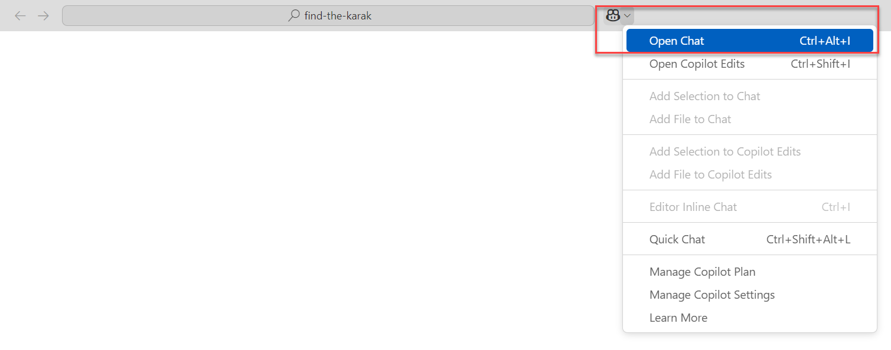
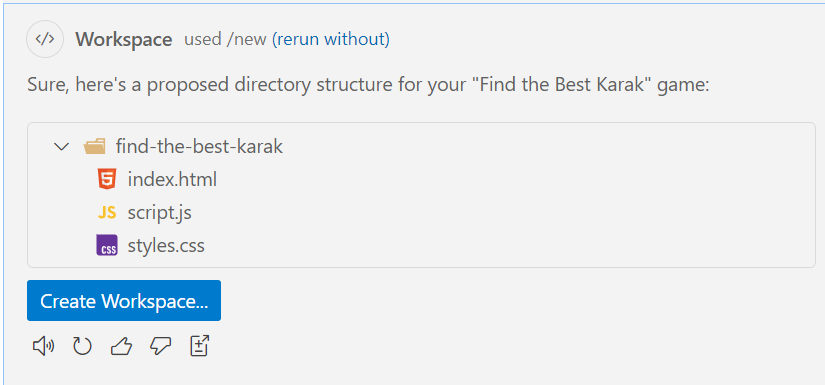
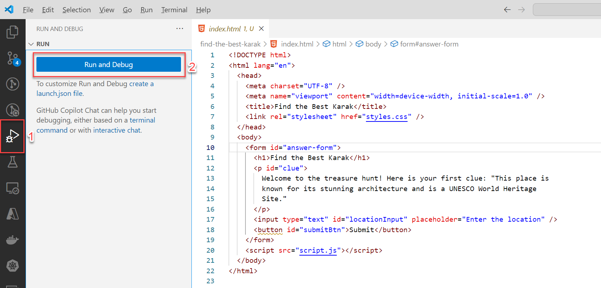

# Find the Best Karak: GitHub Copilot Tutorial

## Introduction

 In this tutorial, we will guide you step-by-step to create an online treasure hunt game called Find the Best Karak. You'll learn how to leverage GitHub Copilot to develop this game using HTML and JavaScript. By the end of this tutorial, you’ll be able to create a fun, engaging treasure hunt game that runs on your local PC.

## Prerequisites

* Basic knowledge of HTML and JavaScript

* GitHub account with access to GitHub Copilot.

* Visual Studio Code

## Setup

1. Create a new repository on GitHub to store your project files

    

2. Give a repository name and description, and choose whether to make it public or private

    

3. Copy the repository URL

    

4. Clone the repository to your local machine using VSCode

    

5. Open the project in your code editor

    

## Development

### Task 1: Open GitHub Copilot Chat

 1. Open the Chat view from the Command Center Copilot menu or press ```Ctrl+Alt+I```

    

### Task 2: Ask GitHub Copilot to Create your workspace with neccessary files

 1. Use your imagination to ask Copilot to create the necessary files for your project

    <details>
        <summary>Here is a good prompt that you can use </summary>

        I'm creating a simple online treasure hunt game called "Find the Best Karak" using HTML and JavaScript. 
        The game will provide clues based on touristic places in Qatar, and the player will enter the name of the location to proceed.
        Please help me generate the basic HTML, JavaScript and CSS files needed for this game.
        The HTML file will include a heading, a paragraph to display clues, an input field for the player to enter the location, and a submit button. 
        The JavaScript file will contain the logic for generating clues and checking the player's input.

   </details>

If everything goes well, Copilot will generate the necessary files for your project. You just need to click the "Create Workspace" button and select the folder where you want to save the files.

   

### Task 3: Test the Game

 1. Open the `index.html` file in VSCode and click Run and Debug on the left side of VSCode or ```Ctrl+Shift+D``` to open the debug view. Then click the 'Run and Debug' button to run the game in the browser.

    

 2. Follow the instructions to play the game and see if it works as expected

    

> [!IMPORTANT]  
> You might need to update the `script.js` or `index.html` file to fix any issues or add more functionality to the game

### Task 4: Customize the Game

 1. Modify the game logic in the `script.js` file to add more clues and locations

    ```javascript
    // Add more locations and clues
    const locations = {
        "Doha Corniche": "A beautiful waterfront promenade in the heart of Doha.",
        "Souq Waqif": "A traditional market with cafes, restaurants, and shops.",
        "The Pearl-Qatar": "An artificial island with luxury residences and shopping.",
        "Katara Cultural Village": "A cultural hub with theaters, galleries, and restaurants.",
    };
    ```

 2. Update the game interface in the `index.html` file to improve the user experience

    ```html
    <!-- Update the game interface -->
    <h1>Find the Best Karak</h1>
    <p>Enter the name of the location to get the next clue:</p>
    <input type="text" id="locationInput" placeholder="Enter location name">
    <button onclick="checkLocation()">Submit</button>
    <p id="clue"></p>
    ```