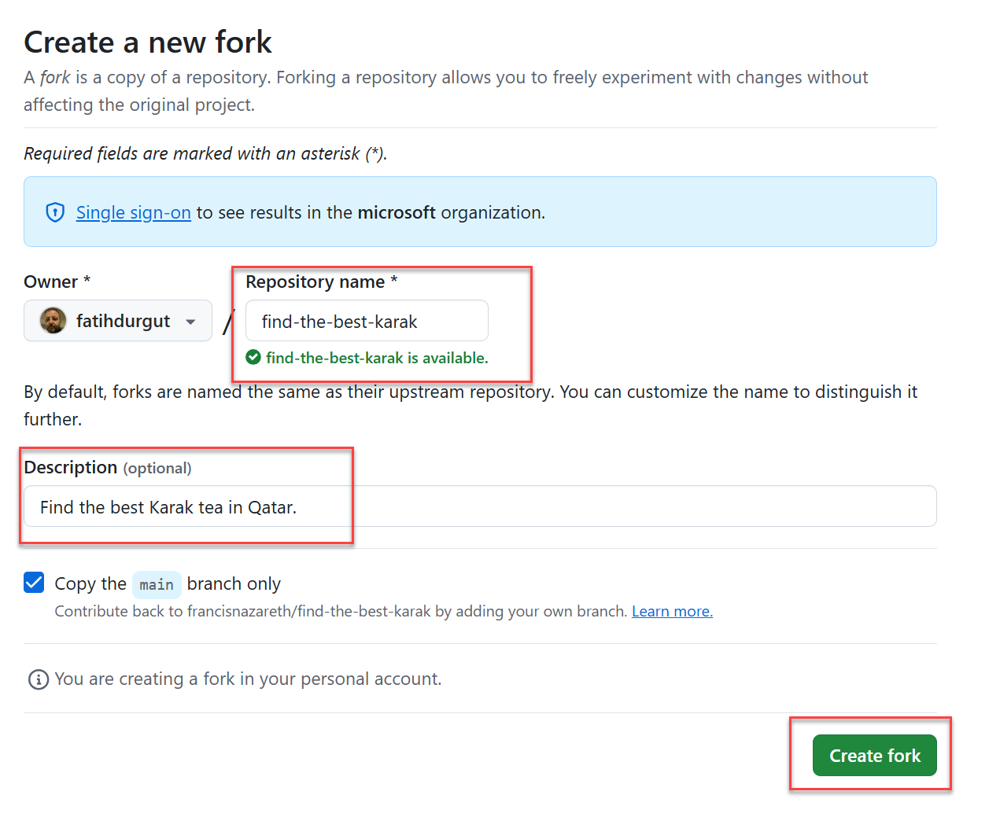

# Find the Best Karak: GitHub Copilot Tutorial

## Introduction

 In this tutorial, we will guide you step-by-step to create an online treasure hunt game called Find the Best Karak. You'll learn how to leverage GitHub Copilot to develop this game using HTML and JavaScript. By the end of this tutorial, you’ll be able to create a fun, engaging treasure hunt game that runs on your local PC.

## Prerequisites

* Basic knowledge of HTML and JavaScript

* GitHub account with access to GitHub Copilot.

* Visual Studio Code

## Setup

1. Create a new repository on GitHub to store your project files

    

2. Give a repository name and description, and choose whether to make it public or private

    

3. Copy the repository URL

    

4. Clone the repository to your local machine using VSCode

    

5. Open the project in your code editor

    

## Development

### Task 1: Open GitHub Copilot Chat

 1. Open the Chat view from the Command Center Copilot menu or press ```Ctrl+Alt+I```

    

### Task 2: Ask GitHub Copilot to Create your workspace with neccessary files

 1. Use your imagination to ask Copilot to create the necessary files for your project

    <details>
        <summary>Here is a good prompt that you can use </summary>

        I'm creating a simple online treasure hunt game called "Find the Best Karak" using HTML and JavaScript. The game will provide clues based on touristic places in Qatar, and the player will enter the name of the location to proceed.
        Please help me generate the basic HTML, JavaScript and CSS files needed for this game.
        The HTML file will include a heading, a paragraph to display clues, an input field for the player to enter the location, and a submit button. 
        The JavaScript file will contain the logic for generating clues and checking the player's input.

   </details>